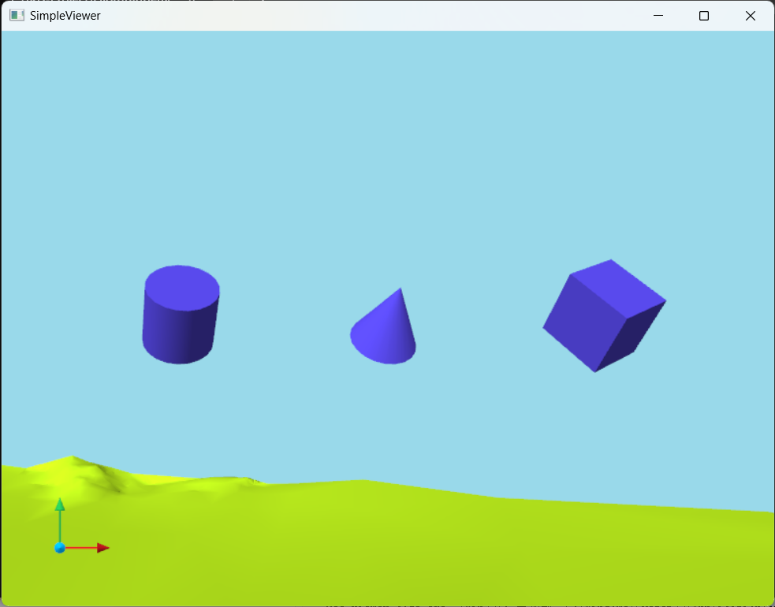
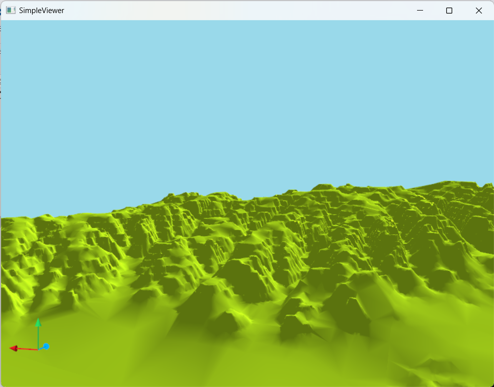

## SimpleViewer

一个简易的跨平台三维视效工具，用于物理引擎的可视化

基于OpenGL（freeglut2.8，glew1.2），单窗口，窗口可重复开闭

目前支持显示的模型：Mesh，Cube，Cylinder，Cone，Line(Strips)，之后可能会增加对文字和基础UI的支持

**坐标轴**：与OpenGL右手坐标系一致

**摄像机**：采用UE风格，可通过鼠标和键盘操控视角的移动

**一些特性**：

- 摄像机、模型与窗口独立管理，窗口开闭不会影响摄像机和模型的数据

- 线程安全，可以在不同的线程中修改摄像机和模型数据，以及开闭窗口

接口信息在opengl_viewer.h中

